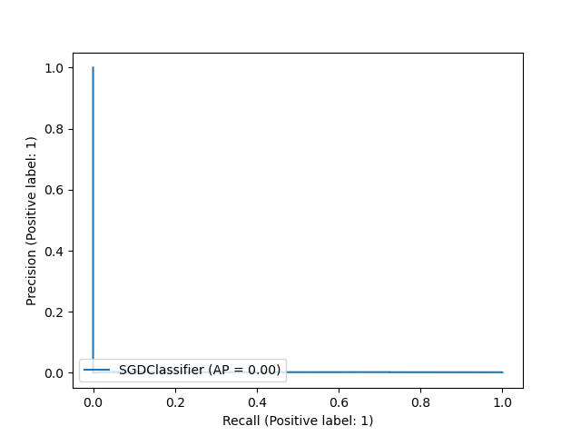

# 💳 Credit Card Fraud Detection

It is important that credit card companies are able to recognize fraudulent credit card transactions so that customers are not charged for items that they did not purchase.

## 1. Problem

Credit card fraud is a huge problem for customers so we need to prevent it

## 2. Data

The dataset contains transactions made by credit cards in September 2013 by European cardholders.
This dataset presents transactions that occurred in two days, where we have 492 frauds out of 284,807 transactions. The dataset is highly unbalanced, the positive class (frauds) account for 0.172% of all transactions.

Dataset is used from Kaggle :
https://www.kaggle.com/datasets/mlg-ulb/creditcardfraud

## 3. Evaluation

> Measuring the accuracy using the Area Under the Precision-Recall Curve (AUPRC).

## 4. Features

Unfortunately, due to confidentiality issues, we cannot provide the original features and more background information about the data.
* V1, V2, … V28 are the principal components obtained with PCA (Principal component analysis)
* Time contains the seconds elapsed between each transaction and the first transaction in the dataset
* Amount is the transaction Amount, this feature can be used for example-dependant cost-sensitive learning
* Class is the response variable and it takes value 1 in case of fraud and 0 otherwise.

### Accuracy is 99.8%

### Here's the Precision-Recall Curve (AUPRC)

